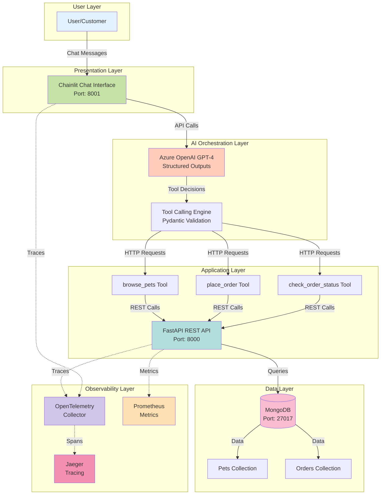
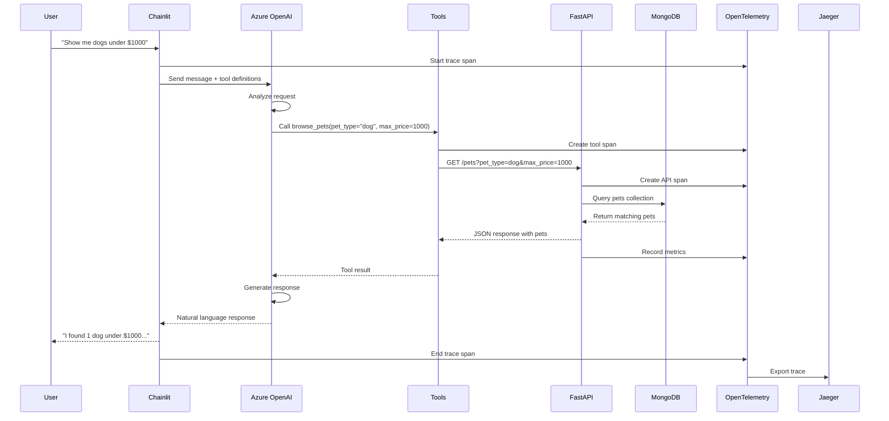
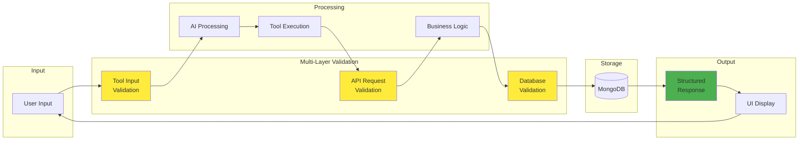
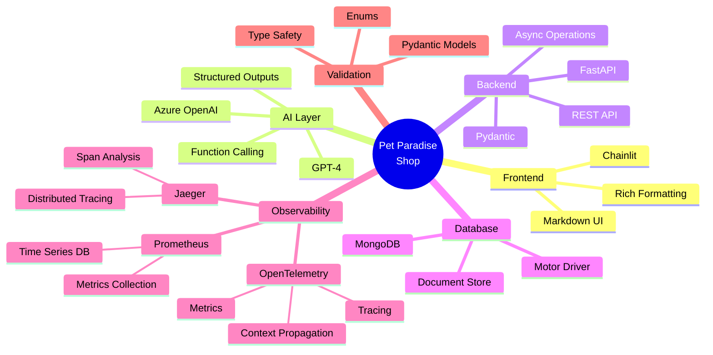
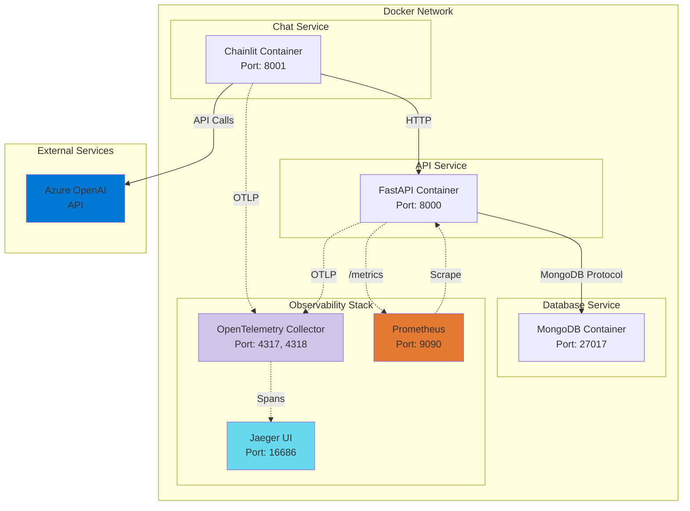
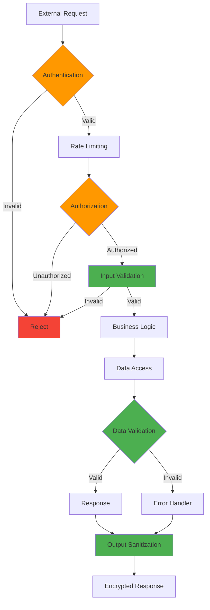
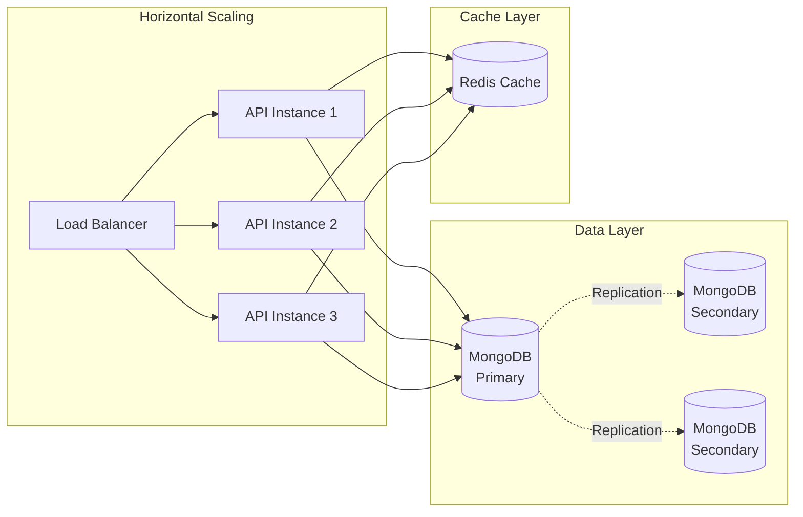

# Architecture Overview

This page provides a comprehensive overview of the Pet Paradise Shop system architecture.

## System Architecture

The system follows a layered architecture with clear separation of concerns:



## Component Interaction Flow



## Data Flow Architecture



## Technology Stack



## Deployment Architecture



## Security Architecture



## Key Architectural Principles

### 1. Separation of Concerns

Each layer has a specific responsibility:

- **UI Layer**: User interaction and display
- **AI Layer**: Natural language processing and tool orchestration
- **Application Layer**: Business logic and data manipulation
- **Data Layer**: Persistence and retrieval

### 2. Type Safety

Pydantic models ensure type correctness throughout:

```python
class Pet(BaseModel):
    id: str
    name: str
    type: PetType  # Enum for type safety
    price: float = Field(gt=0)  # Validation constraint
```

### 3. Async All the Way

Non-blocking I/O for scalability:

```python
async def browse_pets_tool(pet_type: Optional[str] = None):
    async with httpx.AsyncClient() as client:
        response = await client.get(f"{API_BASE_URL}/pets")
```

### 4. Multi-Layer Validation

Validation at every boundary:

1. **Tool Input**: Pydantic validates before tool execution
2. **API Request**: FastAPI validates HTTP requests
3. **Database**: Models validate before persistence

### 5. Observability First

Built-in tracing and metrics:

- OpenTelemetry for distributed tracing
- Prometheus for metrics collection
- Jaeger for trace visualization
- Structured logging throughout

## Scalability Considerations



## Next Steps

- Explore [Component Details](components.md)
- Understand [Data Flow](data-flow.md)
- Learn about [Observability](../observability/overview.md)
