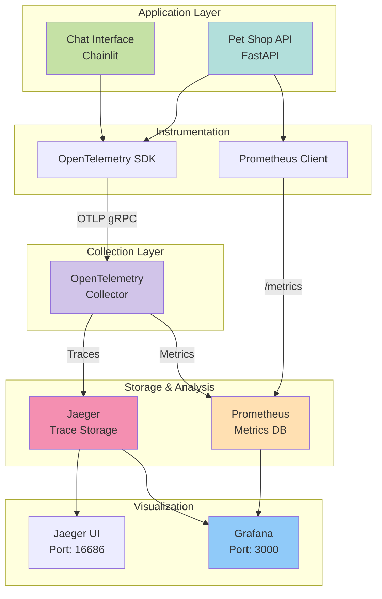
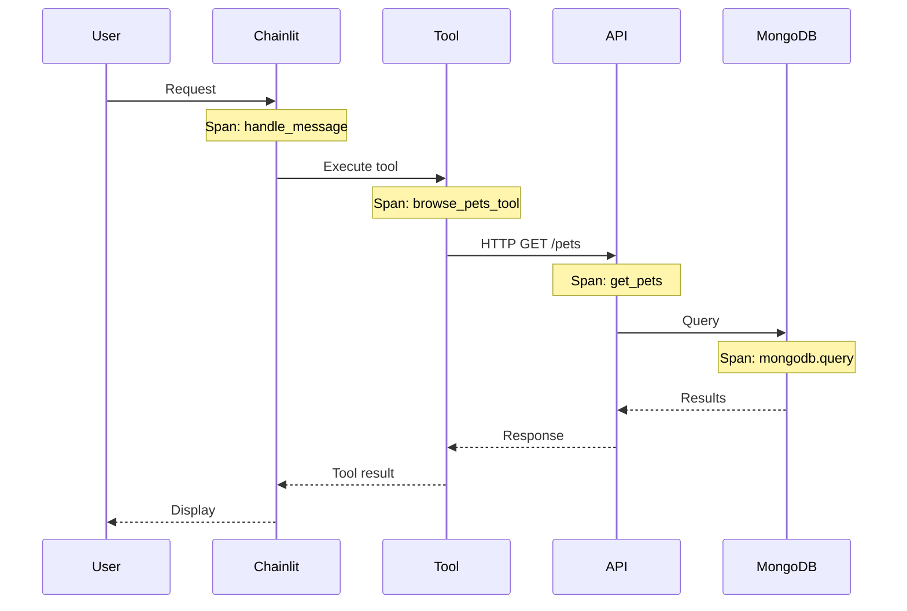

# Observability Overview

Pet Paradise Shop includes a comprehensive observability stack for monitoring, tracing, and debugging.

## Architecture



## Components

### 1. OpenTelemetry

**Purpose**: Unified observability framework for traces, metrics, and logs.

- **SDK**: Instruments application code
- **Collector**: Receives, processes, and exports telemetry data
- **OTLP Protocol**: Standard protocol for telemetry data

**Ports**:
- 4317: OTLP gRPC
- 4318: OTLP HTTP
- 8888: Prometheus metrics
- 13133: Health check

### 2. Jaeger

**Purpose**: Distributed tracing system for monitoring and troubleshooting microservices.

**Features**:
- Trace visualization
- Service dependency analysis
- Performance analysis
- Root cause analysis

**UI Access**: [http://localhost:16686](http://localhost:16686)

**Ports**:
- 16686: Jaeger UI
- 14268: Collector HTTP
- 14250: gRPC
- 6831/6832: Jaeger agent (UDP)

### 3. Prometheus

**Purpose**: Time-series database for metrics collection and querying.

**Features**:
- Metrics scraping
- PromQL query language
- Alerting rules
- Service discovery

**UI Access**: [http://localhost:9090](http://localhost:9090)

**Port**: 9090

### 4. Grafana

**Purpose**: Visualization and analytics platform.

**Features**:
- Custom dashboards
- Multiple data sources
- Alerting
- Beautiful visualizations

**UI Access**: [http://localhost:3000](http://localhost:3000)

**Default Credentials**:
- Username: `admin`
- Password: `admin`

**Port**: 3000

## What We Monitor

### Traces



**Traced Operations**:
- HTTP requests/responses
- Tool executions
- Database queries
- External API calls
- Message processing

### Metrics

**Request Metrics**:
- `petshop_requests_total` - Total requests by method, endpoint, status
- `petshop_request_duration_seconds` - Request duration histogram
- `petshop_active_requests` - Current active requests

**Business Metrics**:
- `petshop_inventory_count` - Pets in inventory by type
- `petshop_orders_total` - Total orders by status
- `petshop_tool_calls_total` - Tool calls by name and success

**System Metrics**:
- CPU usage
- Memory usage
- Network I/O
- Database connections

### Logs

**Log Levels**:
- ERROR: Application errors
- WARNING: Warning conditions
- INFO: Informational messages
- DEBUG: Debug information

**Structured Logging** with context:
- Trace ID
- Span ID
- Service name
- Timestamp
- Log level

## Quick Start

### Start with Full Observability

```bash
docker-compose -f docker-compose-observability.yml up -d
```

This starts:
- MongoDB
- Pet Shop API
- Chat Interface
- Jaeger
- OpenTelemetry Collector
- Prometheus
- Grafana

### Access Services

| Service | URL | Purpose |
|---------|-----|---------|
| Chat Interface | http://localhost:8001 | User interface |
| API | http://localhost:8000 | REST API |
| API Docs | http://localhost:8000/docs | API documentation |
| Jaeger UI | http://localhost:16686 | Trace visualization |
| Prometheus | http://localhost:9090 | Metrics database |
| Grafana | http://localhost:3000 | Dashboards |

## Example Queries

### Prometheus Queries (PromQL)

**Request rate per endpoint**:
```promql
rate(petshop_requests_total[5m])
```

**Average request duration**:
```promql
rate(petshop_request_duration_seconds_sum[5m]) / 
rate(petshop_request_duration_seconds_count[5m])
```

**95th percentile latency**:
```promql
histogram_quantile(0.95, 
  rate(petshop_request_duration_seconds_bucket[5m])
)
```

**Current inventory by type**:
```promql
petshop_inventory_count
```

**Order rate**:
```promql
rate(petshop_orders_total[5m])
```

### Jaeger Trace Search

**Find slow requests**:
- Service: `petshop-api`
- Operation: `get_pets`
- Min Duration: 1s

**Find errors**:
- Tags: `error=true`
- Service: `petshop-api`

**Trace by ID**:
- Enter trace ID from logs

## Benefits

### For Development

- **Debug Issues**: See exact request flow and timing
- **Performance**: Identify bottlenecks
- **Understanding**: Visualize system behavior
- **Testing**: Verify integrations work

### For Operations

- **Monitoring**: Real-time system health
- **Alerting**: Get notified of issues
- **Capacity Planning**: Understand resource usage
- **SLA Tracking**: Measure performance

### For Business

- **User Experience**: Track response times
- **Feature Usage**: See which features are used
- **Order Tracking**: Monitor order volume
- **Inventory Management**: Track pet inventory

## Next Steps

- Review the [Architecture Overview](../architecture/overview.md)
- Explore [Getting Started](../getting-started/quickstart.md)
